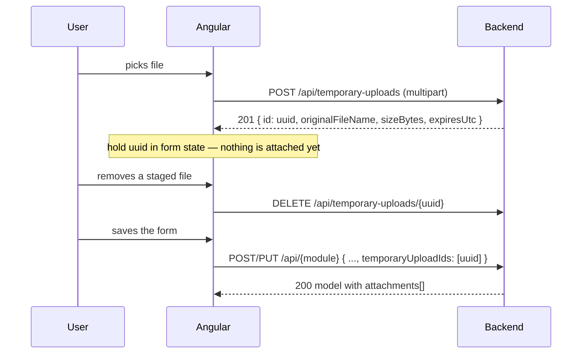

# Request Attachments — Frontend Implementation Brief

**Scope:** add file attachments to the three request modules — **Leaves**, **Permissions**, **Work Missions** — on both the create and the edit screens, plus download from the list screens.

All three use one identical mechanism. Build the upload/attachment UI **once** as a shared component and wire it into three forms. The only per-module differences are the route, the request body fields, and the role gate — tabulated in [Per-module reference](#per-module-reference).

> **This changes existing endpoints.** `POST` and `PUT` on all three modules no longer accept the full row model. They take dedicated request objects, and the API **rejects any unrecognised JSON property** with `400 VALIDATION_FAILED`. Existing create/edit calls that echo the fetched model back will break. Rewriting those three create and three edit payloads is part of this task, not optional.

---

## Table of Contents

1. [How it works](#1-how-it-works)
2. [Limits and validation rules](#2-limits-and-validation-rules)
3. [Auth and the response envelope](#3-auth-and-the-response-envelope)
4. [Shared endpoints: staging](#4-shared-endpoints-staging)
5. [Shared TypeScript types](#5-shared-typescript-types)
6. [Creating with attachments](#6-creating-with-attachments)
7. [Editing attachments — the keep-list](#7-editing-attachments--the-keep-list)
8. [Reading attachments on list screens](#8-reading-attachments-on-list-screens)
9. [Downloading an attachment](#9-downloading-an-attachment)
10. [Per-module reference](#10-per-module-reference)
11. [Shared Angular implementation](#11-shared-angular-implementation)
12. [Error keys for i18n](#12-error-keys-for-i18n)
13. [Rules you must design around](#13-rules-you-must-design-around)
14. [Definition of done](#14-definition-of-done)

---

## 1. How it works

Files are **never** sent with the request form. Two steps:

1. **Stage.** As soon as the user picks a file, upload it to `POST /api/temporary-uploads`. You get back a UUID. The file now sits in a staging area for 24 hours, owned by that user, belonging to no record.
2. **Submit.** When the user saves the form, send those UUIDs in the create/update body. The backend converts them into permanent attachments **inside the same transaction** as the record itself.



Why two steps: the user gets per-file validation feedback immediately while still filling in the form, and the record is never half-created with unusable files. A staged file that is never submitted is cleaned up automatically after 24 hours.

The staging endpoint is **module-agnostic** — the same call serves all three modules. Which module owns the file is decided by where you send the UUID.

---

## 2. Limits and validation rules

Enforce all of these client-side for instant feedback. The server enforces them too; never rely on only one side.

| Rule | Value |
|---|---|
| Max files per record | **3** |
| Max size per file | **5 MiB** (5,242,880 bytes) |
| Max total per upload call | **15 MiB** (15,728,640 bytes) |
| Allowed types | `.pdf`, `.jpg`, `.jpeg`, `.png` |
| Max image dimensions | 10,000 × 10,000, and 40 MP total |
| Staged file lifetime | **24 hours** |
| Empty files | rejected |

The server does **not** trust the file extension or the browser's `Content-Type`. It reads the file's magic bytes and parses the PDF/image structure. A renamed `.exe` is rejected with `ATTACHMENT_SIGNATURE_INVALID`; a truncated image with `ATTACHMENT_CONTENT_MALFORMED`. Your extension check is a convenience — always handle these server errors too.

**The 3-file cap is on the record, not the request.** On edit it applies to kept + newly staged combined. A user already at 3 must remove one before adding another.

---

## 3. Auth and the response envelope

Auth is an **`HttpOnly` cookie** (`access_token`) — not a header you control. Every request in this brief needs credentials:

```ts
this.http.post(url, body, { withCredentials: true });
```

If you have a global `withCredentials` interceptor, you are already covered. **Do not** set `Content-Type` manually on the upload call — the browser must generate the `multipart/form-data` boundary itself.

Every JSON endpoint returns:

```ts
interface ApiResponse<T> {
  data?: T;
  error: {
    messageKey: string;                    // stable i18n key — branch on this
    message: string;                       // English fallback, debugging only
    details?: Record<string, string[]>;    // present on validation failures
  } | null;
}
```

Always branch on `error.messageKey`, never on `error.message`.

---

## 4. Shared endpoints: staging

### Upload

```http
POST /api/temporary-uploads
Content-Type: multipart/form-data
```

Form field name must be exactly **`files`**, repeated once per file.

**`201 Created`**

```json
{
  "data": [{
    "id": "3f2504e0-4f89-11d3-9a0c-0305e82c3301",
    "originalFileName": "medical-report.pdf",
    "contentType": "application/pdf",
    "sizeBytes": 148213,
    "expiresUtc": "2026-08-17T09:14:22.113Z"
  }],
  "error": null
}
```

**Upload one file per call.** The endpoint accepts several, but a batch is atomic — one bad file rejects the whole call and returns no UUIDs at all, forcing the user to re-pick everything. One call per file gives you per-file error reporting.

### Cancel

```http
DELETE /api/temporary-uploads/{temporaryUploadId}
```

Call this when the user removes a **staged** file before saving, so it does not sit on disk for 24 hours. Cancelling an already-cancelled or expired upload succeeds silently, so it is safe to fire-and-forget.

| Status | `messageKey` | When |
|---|---|---|
| 404 | `TEMPORARY_UPLOAD_NOT_FOUND` | Unknown UUID, or it belongs to another user |
| 409 | `TEMPORARY_UPLOAD_ALREADY_CONSUMED` | The record was already saved with it |

> Do **not** call this for an attachment already saved on a record — that is a different thing entirely, removed via the keep-list on `PUT`. See [section 7](#7-editing-attachments--the-keep-list).

---

## 5. Shared TypeScript types

```ts
/** Returned by POST /api/temporary-uploads. Valid 24h, until consumed. */
export interface TemporaryUpload {
  id: string;              // UUID — send in temporaryUploadIds
  originalFileName: string;
  contentType: string;
  sizeBytes: number;
  expiresUtc: string;      // ISO-8601 UTC
}

/** A saved attachment. Appears on every list row of all three modules. */
export interface Attachment {
  id: number;              // integer — use in the download URL and keptAttachmentIds
  originalFileName: string;
  contentType: string;
  sizeBytes: number;
}
```

> **Three different ids, do not mix them up.** `TemporaryUpload.id` is a **UUID**, valid only before save, goes in `temporaryUploadIds`. `Attachment.id` is an **integer**, exists only after save, goes in the download URL and in `keptAttachmentIds`. The underlying stored-file id is never exposed.

---

## 6. Creating with attachments

Every create body is: **the module's own fields + `temporaryUploadIds`**. Nothing else. See [section 10](#10-per-module-reference) for each module's fields.

```jsonc
// POST /api/Permissions
{
  "permissionDate": "2026-08-20",
  "fkReasonId": 3,
  "fkPermissionTypeId": 1,
  "description": "Medical appointment",
  "temporaryUploadIds": ["3f2504e0-4f89-11d3-9a0c-0305e82c3301"]
}
```

`temporaryUploadIds` is required — send `[]` when there are no files.

**Nothing is partially saved.** The record and its attachment links commit or roll back together. If create fails, the staged UUIDs are still valid (unless expired), so **do not clear the attachment list from form state on a failed submit** — the user fixes the form and resubmits with the same UUIDs.

The response returns the created model with its final `attachments` array; use it to update the grid without a refetch.

---

## 7. Editing attachments — the keep-list

This is the part to read carefully. Every update body is: **the module's own fields + `id` + `concurrencyUpdateVersion` + `keptAttachmentIds` + `temporaryUploadIds`.**

```jsonc
// PUT /api/Permissions
{
  "id": 512,
  "concurrencyUpdateVersion": "AAAAAAAAB9E=",
  "permissionDate": "2026-08-20",
  "fkReasonId": 3,
  "fkPermissionTypeId": 1,
  "description": "Medical appointment (rescheduled)",
  "keptAttachmentIds": [87],                                    // 88 was removed
  "temporaryUploadIds": ["9c1e77a2-0f43-4c31-b0f6-6b1d9d2e4a10"] // and replaced
}
```

### `keptAttachmentIds` is a keep-list, not a delete-list

Send the ids of the attachments that should **still be there when the edit finishes**. Anything currently attached and missing from the list is removed.

| User action in the dialog | What you send |
|---|---|
| Leaves attachments alone | every existing `attachments[].id` |
| Removes one attachment | every existing id **except** that one |
| Removes all attachments | `[]` |
| Adds a file | unchanged `keptAttachmentIds` + its UUID in `temporaryUploadIds` |
| Replaces a file | old id **omitted** from `keptAttachmentIds` + new UUID in `temporaryUploadIds` |

> ⚠️ **`keptAttachmentIds` is required and defaults to empty, and empty means "keep none".** There is no "leave them as they are" value. Omit the field and every attachment is deleted. Always send it explicitly.

### Why it works this way

Removals travel **with** the save. There is deliberately no standalone "delete this attachment" endpoint, because a user who removes a file and then cancels the dialog — or whose save fails validation — would otherwise have already lost it. Here nothing reaches the server until save, the whole edit is one transaction, and a retried request is idempotent.

This maps straight onto form state: bind the dialog to a working copy of `attachments`, let the user add and remove freely, and on submit send `working.map(a => a.id)`.

### Concurrency

Echo `concurrencyUpdateVersion` back **exactly as received** — it is a base64 string in JSON and must not be reformatted or regenerated. A stale value returns `409 RECORD_MODIFIED_BY_ANOTHER_USER`; refetch the row and let the user retry.

### Failures

The whole edit is one transaction: if any part fails, the field changes *and* the attachment changes roll back together.

| Status | `messageKey` | Meaning |
|---|---|---|
| 400 | `VALIDATION_FAILED` | Malformed body or an unknown property — a bug in your payload |
| 400 | `ATTACHMENT_TOO_MANY_FILES` | kept + new exceeds 3 |
| 404 | `RESOURCE_NOT_FOUND` | Record gone, or a kept id is not one of its attachments — refetch |
| 409 | `RECORD_MODIFIED_BY_ANOTHER_USER` | Stale `concurrencyUpdateVersion` |
| 409 | `TEMPORARY_UPLOAD_NOT_AVAILABLE` | A new upload expired or was already used |

Plus each module's own business errors — see [section 10](#10-per-module-reference).

**Removed files are not destroyed immediately.** They enter a 30-day retention window, recoverable server-side but not through the API.

---

## 8. Reading attachments on list screens

Every paginated list endpoint on all three modules now returns an `attachments` array on every row. **No request change needed** — just render it.

```json
{
  "data": {
    "list": [{
      "id": 512,
      "attachments": [{
        "id": 87,
        "originalFileName": "medical-report.pdf",
        "contentType": "application/pdf",
        "sizeBytes": 148213
      }]
    }],
    "paginationInfo": { "currentPage": 1, "pageSize": 10, "totalPages": 4, "totalItems": 34 }
  },
  "error": null
}
```

The array is always present and is `[]` when empty — no null check needed. It is ordered oldest-first and already excludes files pending deletion, so **anything listed is downloadable**. Show a paperclip icon or count on rows where it is non-empty.

---

## 9. Downloading an attachment

```
GET {moduleBase}/{recordId}/attachments/{attachmentId}/content
```

`attachmentId` is `attachments[].id` from the row. Both ids are validated together — an attachment id belonging to a different record returns 404.

Three things to get right:

**Use `responseType: 'blob'` with credentials.** Do not use a plain `<a href>` or `window.open`. A denied or missing file returns a JSON error body, which would open a blank tab or save a file full of JSON instead of showing an error.

**Take the filename from the row, not the response.** The server sends `Content-Disposition`, but CORS does not expose that header to JavaScript — it reads as `null`. Use `attachment.originalFileName`, which you already have.

**Treat 404 as "not available", not "forbidden".** Authorization failures deliberately return `404 RESOURCE_NOT_FOUND` so the API never confirms a record exists to someone who may not see it. Show a neutral message.

You do not need to compute visibility client-side: anyone who can see the row on a grid can download its attachments. Render the download button whenever `attachments` is non-empty.

---

## 10. Per-module reference

### Leaves — base `/api/leaves`

| Action | Endpoint | Role |
|---|---|---|
| My leaves grid | `POST /api/leaves/GetMyLeavesWithPaging` | any authenticated |
| Department grid | `POST /api/leaves/GetWithPaging` | HR Officer |
| Created-by-me grid | `POST /api/leaves/GetMyCreatedLeavesWithPaging` | Department Manager |
| Create | `POST /api/leaves` | Department Manager |
| Edit | `PUT /api/leaves` | Department Manager |
| Delete | `DELETE /api/leaves/{id}` | Department Manager |
| Download | `GET /api/leaves/{leaveId}/attachments/{attachmentId}/content` | any authenticated |

```ts
interface CreateLeaveRequest {
  fkEmployeeId: number;            // >= 1
  dateFrom: string;                // "YYYY-MM-DD"
  dateTo: string;
  fkLeaveTypeId: number;           // >= 1
  temporaryUploadIds: string[];
}

interface UpdateLeaveRequest {
  id: number;
  concurrencyUpdateVersion: string;
  fkEmployeeId: number;
  dateFrom: string;
  dateTo: string;
  fkLeaveTypeId: number;
  keptAttachmentIds: number[];
  temporaryUploadIds: string[];
}
```

Module errors: `LEAVE_INVALID_DATE_RANGE`, `LEAVE_OVERLAPPING_DATES`, `LEAVE_ALREADY_DECIDED` (only status New can be edited or deleted), `LEAVE_TYPE_NOT_FOUND`, `AUTH_FORBIDDEN_ACTION`, `AUTH_USER_NOT_ACTIVE`.
Status enum: `New = 1, Accepted = 2, Rejected = 3`. **Editing is only possible while status is New** — hide the edit action otherwise.

### Permissions — base `/api/Permissions`

| Action | Endpoint | Role |
|---|---|---|
| My permissions grid | `POST /api/Permissions/GetWithPaging` | any authenticated |
| Department grid | `POST /api/Permissions/GetDepartmentPermissionsWithPaging` | Department Manager or HR Officer |
| Create | `POST /api/Permissions` | any authenticated |
| Edit | `PUT /api/Permissions` | any authenticated |
| Delete | `DELETE /api/Permissions/{id}` | any authenticated |
| Download | `GET /api/Permissions/{permissionId}/attachments/{attachmentId}/content` | any authenticated |

```ts
interface CreatePermissionRequest {
  permissionDate: string;          // "YYYY-MM-DD"
  fkReasonId: number;              // >= 1
  fkPermissionTypeId: number;      // >= 1
  description: string;             // required, max 250 chars
  temporaryUploadIds: string[];
}

interface UpdatePermissionRequest {
  id: number;
  concurrencyUpdateVersion: string;
  permissionDate: string;
  fkReasonId: number;
  fkPermissionTypeId: number;
  description: string;
  keptAttachmentIds: number[];
  temporaryUploadIds: string[];
}
```

Module errors: `DAILY_PERMISSION_LIMIT_EXCEEDED`, `MONTHLY_PERMISSION_LIMIT_EXCEEDED`, `CANNOT_BE_DELETE` (only status New can be deleted).
Status enum: `New = 1, Accepted = 2, Rejected = 3, FirstAccepted = 4, AutoRejected = 5`. Show edit and delete only for the user's own permissions in status New.

### Work Missions — base `/api/WorkMission`

| Action | Endpoint | Role |
|---|---|---|
| Department grid | `POST /api/WorkMission/GetWithPaging` | any authenticated |
| My missions grid | `POST /api/WorkMission/GetMyWorkMissionsAsync` | Employee |
| Create | `POST /api/WorkMission` | Department Manager or HR Officer |
| Edit | `PUT /api/WorkMission` | Department Manager or HR Officer, **and** must be the creator |
| Delete | `DELETE /api/WorkMission/{id}` | must be the creator |
| Download | `GET /api/WorkMission/{workMissionId}/attachments/{attachmentId}/content` | any authenticated |

```ts
enum WorkMissionType { ShiftBeginning = 1, ShiftEnding = 2, FullDay = 3 }

interface CreateWorkMissionRequest {
  nameAr: string;                  // required, max 250
  nameEn?: string | null;          // optional, max 250
  startDate: string;               // "YYYY-MM-DD"
  endDate: string;
  description: string;             // required
  workMissionType: WorkMissionType;
  temporaryUploadIds: string[];
}

interface UpdateWorkMissionRequest {
  id: number;
  concurrencyUpdateVersion: string;
  nameAr: string;
  nameEn?: string | null;
  startDate: string;
  endDate: string;
  description: string;
  workMissionType: WorkMissionType;
  keptAttachmentIds: number[];
  temporaryUploadIds: string[];
}
```

Module errors: `CAN_NOT_TAKE_ACTION` (not the creator — returned as **400**, not 403).
Use the `isMissionCreator` flag already on each grid row to decide whether to show edit and delete. Do not infer it from the user's role — HR cannot edit a mission it did not create. Assigning employees remains a separate call (`POST /api/WorkMission/AddUsersToMission`), unchanged.

---

## 11. Shared Angular implementation

### Staging service — build once, use in all three modules

```ts
import { HttpClient } from '@angular/common/http';
import { Injectable, inject } from '@angular/core';
import { Observable, map } from 'rxjs';

export const ATTACHMENT_LIMITS = {
  maxFiles: 3,
  maxFileSizeBytes: 5 * 1024 * 1024,
  maxBatchSizeBytes: 15 * 1024 * 1024,
  allowedExtensions: ['.pdf', '.jpg', '.jpeg', '.png'],
} as const;

@Injectable({ providedIn: 'root' })
export class TemporaryUploadService {
  private readonly http = inject(HttpClient);

  /** One file per call, so each can fail independently. */
  upload(file: File): Observable<TemporaryUpload> {
    const form = new FormData();
    form.append('files', file, file.name);   // field name must be "files"

    // No Content-Type header — the browser sets the multipart boundary.
    return this.http
      .post<ApiResponse<TemporaryUpload[]>>('/api/temporary-uploads', form, {
        withCredentials: true,
      })
      .pipe(map(res => res.data![0]));
  }

  cancel(temporaryUploadId: string): Observable<void> {
    return this.http
      .delete<ApiResponse<string>>(`/api/temporary-uploads/${temporaryUploadId}`, {
        withCredentials: true,
      })
      .pipe(map(() => void 0));
  }

  /** Works for every module — pass the module's base route. */
  download(moduleBase: string, recordId: number, attachment: Attachment): Observable<void> {
    return this.http
      .get(`${moduleBase}/${recordId}/attachments/${attachment.id}/content`, {
        responseType: 'blob',
        withCredentials: true,
      })
      .pipe(map(blob => saveAs(blob, attachment.originalFileName)));
  }
}

/** Filename comes from the row: CORS does not expose Content-Disposition. */
function saveAs(blob: Blob, fileName: string): void {
  const url = URL.createObjectURL(blob);
  const link = document.createElement('a');
  link.href = url;
  link.download = fileName;
  link.click();
  URL.revokeObjectURL(url);
}
```

### Client-side pre-validation

Reuse the same `messageKey` strings the error interceptor already translates, so client and server rejections render identically.

```ts
export function validateAttachment(
  file: File,
  currentCount: number,
  currentBytes: number,
): string | null {
  if (currentCount >= ATTACHMENT_LIMITS.maxFiles) return 'ATTACHMENT_TOO_MANY_FILES';
  if (file.size === 0) return 'ATTACHMENT_EMPTY_FILE';
  if (file.size > ATTACHMENT_LIMITS.maxFileSizeBytes) return 'ATTACHMENT_FILE_TOO_LARGE';

  const extension = file.name.slice(file.name.lastIndexOf('.')).toLowerCase();
  if (!ATTACHMENT_LIMITS.allowedExtensions.includes(extension as never)) {
    return 'ATTACHMENT_TYPE_NOT_ALLOWED';
  }
  if (currentBytes + file.size > ATTACHMENT_LIMITS.maxBatchSizeBytes) {
    return 'ATTACHMENT_BATCH_TOO_LARGE';
  }
  return null;
}
```

### Shared attachment-editor component

One component covers create and edit. It owns two lists and exposes exactly what the request bodies need.

```ts
@Component({ selector: 'app-attachment-editor', standalone: true, /* ... */ })
export class AttachmentEditorComponent {
  private readonly uploads = inject(TemporaryUploadService);

  /** Create mode: []. Edit mode: seed from the row's attachments. */
  readonly existing = input<Attachment[]>([]);
  readonly recordId = input<number | null>(null);
  readonly moduleBase = input.required<string>();

  readonly kept = signal<Attachment[]>([]);
  readonly staged = signal<TemporaryUpload[]>([]);
  readonly uploading = signal(0);

  readonly totalCount = computed(() => this.kept().length + this.staged().length);
  readonly canAddMore = computed(() => this.totalCount() < ATTACHMENT_LIMITS.maxFiles);
  readonly isBusy = computed(() => this.uploading() > 0);

  /** Feed these two straight into the create/update request body. */
  readonly keptAttachmentIds = computed(() => this.kept().map(x => x.id));
  readonly temporaryUploadIds = computed(() => this.staged().map(x => x.id));

  constructor() {
    effect(() => this.kept.set([...this.existing()]));
  }

  onFilesPicked(files: FileList): void {
    const bytes = this.kept().reduce((s, x) => s + x.sizeBytes, 0)
                + this.staged().reduce((s, x) => s + x.sizeBytes, 0);

    for (const file of Array.from(files)) {
      const clientError = validateAttachment(file, this.totalCount(), bytes);
      if (clientError) { this.toast.error(this.i18n.translate(clientError)); continue; }

      this.uploading.update(n => n + 1);
      this.uploads.upload(file).subscribe({
        next: staged => this.staged.update(list => [...list, staged]),
        error: (err: HttpErrorResponse) =>
          this.toast.error(this.i18n.translate(err.error?.error?.messageKey ?? 'SERVER_ERROR')),
        complete: () => this.uploading.update(n => n - 1),
      });
    }
  }

  /** Saved attachment: drop from the keep-list only. No request until save. */
  removeExisting(attachment: Attachment): void {
    this.kept.update(list => list.filter(x => x.id !== attachment.id));
  }

  /** Staged file: drop it and release the staging slot. */
  removeStaged(upload: TemporaryUpload): void {
    this.staged.update(list => list.filter(x => x.id !== upload.id));
    this.uploads.cancel(upload.id).subscribe({ error: () => {} });   // best-effort
  }

  download(attachment: Attachment): void {
    this.uploads.download(this.moduleBase(), this.recordId()!, attachment).subscribe({
      error: () => this.toast.error(this.i18n.translate('RESOURCE_NOT_FOUND')),
    });
  }
}
```

### Wiring it into a form

```ts
save(): void {
  const request: UpdatePermissionRequest = {
    id: this.permission.id,
    concurrencyUpdateVersion: this.permission.concurrencyUpdateVersion,
    permissionDate: this.form.value.permissionDate,
    fkReasonId: this.form.value.fkReasonId,
    fkPermissionTypeId: this.form.value.fkPermissionTypeId,
    description: this.form.value.description,
    keptAttachmentIds: this.editor.keptAttachmentIds(),      // omitted ids are removed
    temporaryUploadIds: this.editor.temporaryUploadIds(),
  };

  this.permissions.update(request).subscribe({
    next: updated => this.dialogRef.close(updated),
    error: (err: HttpErrorResponse) =>
      this.toast.error(this.i18n.translate(err.error?.error?.messageKey ?? 'SERVER_ERROR')),
  });
}
```

Disable the save button while `editor.isBusy()` — otherwise the user can submit before a UUID has arrived.

---

## 12. Error keys for i18n

One shared set across all three modules.

| Key | English | Arabic |
|---|---|---|
| `ATTACHMENT_FILES_REQUIRED` | At least one file is required. | يجب إرفاق ملف واحد على الأقل. |
| `ATTACHMENT_TOO_MANY_FILES` | You can attach up to 3 files. | يمكنك إرفاق ٣ ملفات كحد أقصى. |
| `ATTACHMENT_FILE_TOO_LARGE` | Each file must be 5 MB or smaller. | يجب ألا يتجاوز حجم الملف ٥ ميجابايت. |
| `ATTACHMENT_BATCH_TOO_LARGE` | Total attachment size must be 15 MB or smaller. | يجب ألا يتجاوز إجمالي حجم المرفقات ١٥ ميجابايت. |
| `ATTACHMENT_EMPTY_FILE` | The file is empty. | الملف فارغ. |
| `ATTACHMENT_TYPE_NOT_ALLOWED` | Only PDF, JPEG, and PNG files are allowed. | يُسمح فقط بملفات PDF و JPEG و PNG. |
| `ATTACHMENT_SIGNATURE_INVALID` | The file content could not be verified. | تعذر التحقق من محتوى الملف. |
| `ATTACHMENT_EXTENSION_MISMATCH` | The file extension does not match its content. | امتداد الملف لا يطابق محتواه. |
| `ATTACHMENT_CONTENT_MALFORMED` | The file is corrupt or unreadable. | الملف تالف أو غير قابل للقراءة. |
| `ATTACHMENT_IMAGE_DIMENSIONS_EXCEEDED` | The image dimensions are too large. | أبعاد الصورة كبيرة جدًا. |
| `ATTACHMENT_FILE_NAME_INVALID` | The file name is invalid. | اسم الملف غير صالح. |
| `ATTACHMENT_STORAGE_UNAVAILABLE` | File storage is temporarily unavailable. | خدمة تخزين الملفات غير متاحة مؤقتًا. |
| `TEMPORARY_UPLOAD_NOT_FOUND` | The uploaded file is no longer available. | الملف المرفوع لم يعد متاحًا. |
| `TEMPORARY_UPLOAD_NOT_AVAILABLE` | An attachment expired. Please upload it again. | انتهت صلاحية أحد المرفقات. يرجى رفعه مرة أخرى. |
| `TEMPORARY_UPLOAD_ALREADY_CONSUMED` | The attachment is already linked to a request. | المرفق مرتبط بالفعل بطلب. |
| `TEMPORARY_UPLOAD_FILE_NOT_AVAILABLE` | An attachment is no longer available. Please upload it again. | أحد المرفقات لم يعد متاحًا. يرجى رفعه مرة أخرى. |
| `TEMPORARY_UPLOAD_IDS_INVALID` | Invalid attachment references. | مراجع المرفقات غير صالحة. |
| `RESOURCE_NOT_FOUND` | The attachment is not available. | المرفق غير متاح. |
| `RECORD_MODIFIED_BY_ANOTHER_USER` | This record was changed by someone else. Please refresh. | تم تعديل هذا السجل بواسطة مستخدم آخر. يرجى التحديث. |
| `VALIDATION_FAILED` | Please check the entered data. | يرجى التحقق من البيانات المدخلة. |

`ATTACHMENT_STORAGE_UNAVAILABLE` returns HTTP 503 and means the file server is down, not user error — word it as retry-later.

---

## 13. Rules you must design around

**Staged UUIDs are single-use and user-scoped.** Once saved they cannot be reused; a second submit with the same UUID fails with `TEMPORARY_UPLOAD_NOT_FOUND`. They are tied to the uploading user, so they cannot cross sessions or users.

**Watch the 24-hour clock on long-lived forms.** A draft left open overnight holds expired UUIDs and fails on submit with `TEMPORARY_UPLOAD_NOT_AVAILABLE`. If a form can stay open that long, check `expiresUtc` before submitting and prompt to re-upload.

**Never call `DELETE /api/temporary-uploads/{id}` for a saved attachment.** Staged files are cancelled that way; saved attachments are removed by omitting their id from `keptAttachmentIds` on the next `PUT`. Confusing the two is the most likely bug in this task.

**Deleting a record removes its attachments.** No extra call. They vanish from the API immediately and are purged after a 30-day retention window.

**Upload is the slow call.** Show per-file progress (`reportProgress: true` with `observe: 'events'`) and disable save while any upload is in flight.

**Editing is gated by module rules, not just roles.** Leaves and Permissions can only be edited while status is New; Work Missions only by their creator. Drive these from the row data (`status`, `isMissionCreator`), not from the user's role.

---

## 14. Definition of done

- [ ] Shared `TemporaryUploadService` with `upload`, `cancel`, `download`.
- [ ] Shared attachment-editor component used by all six forms (3 create + 3 edit).
- [ ] Client-side validation for count, per-file size, total size, extension — using the shared `messageKey` strings.
- [ ] **Leave** create and edit send `CreateLeaveRequest` / `UpdateLeaveRequest` exactly — no extra properties.
- [ ] **Permission** create and edit send `CreatePermissionRequest` / `UpdatePermissionRequest` exactly.
- [ ] **Work Mission** create and edit send `CreateWorkMissionRequest` / `UpdateWorkMissionRequest` exactly.
- [ ] All six requests send `temporaryUploadIds` (`[]` when empty); the three edits also send `keptAttachmentIds` explicitly.
- [ ] `concurrencyUpdateVersion` echoed unchanged on all three edits; `409` handled with a refresh prompt.
- [ ] Attachment column/icon rendered on all list grids, driven by `attachments.length`.
- [ ] Download uses `responseType: 'blob'` + `withCredentials`, filename from `originalFileName`, 404 shown as "not available".
- [ ] Removing a **staged** file calls `DELETE /api/temporary-uploads/{id}`; removing a **saved** one only drops it from the keep-list.
- [ ] Save disabled while an upload is in flight; file picker disabled at 3 files (kept + staged).
- [ ] Failed submit keeps staged UUIDs in form state for retry.
- [ ] All error keys in section 12 added to both `en` and `ar` translation files.

---

## Reference

Deeper backend detail, if needed: `Docs/Permission-Attachments-Frontend-Guide.md` and `Docs/WorkMission-Attachments-Frontend-Guide.md` (per-module long form), `Docs/Attachment-Integration-Guide.md` (backend design and rationale).
