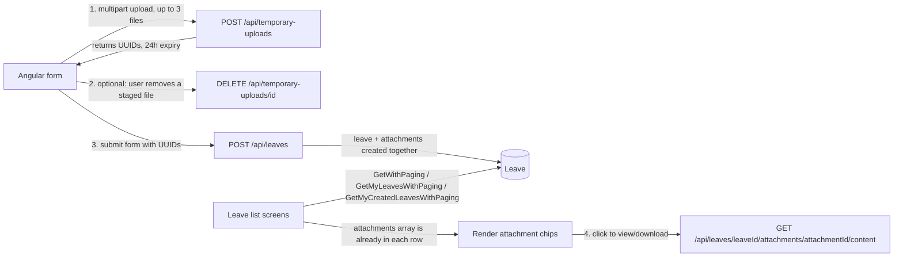

# Leave Attachments API — Angular Frontend Integration Guide

## Purpose

This guide covers everything an Angular developer needs to add file attachments (PDF/JPEG/PNG) to the leave-request feature: staging files before the leave exists, creating the leave with those files attached, reading attachments back from the leave list, and downloading/previewing a stored file.

There is **no dedicated "get attachments for a leave" endpoint**. Attachment metadata is embedded directly in every leave returned by the paginated leave endpoints (`GetWithPaging`, `GetMyLeavesWithPaging`, `GetMyCreatedLeavesWithPaging`). Only file *download* has its own endpoint.

## Base Routes and Authorization

```text
/api/temporary-uploads
/api/leaves
```

All endpoints in this guide require an authenticated user:

```http
Authorization: Bearer <access-token>
```

Creating a leave (`POST /api/leaves`) additionally requires the `DepartmentManager` role. Uploading and cancelling temporary files only require authentication — any signed-in user can stage files, since it's the manager's own session that uploads on behalf of the employee being placed on leave.

## Workflow Overview



1. The client uploads up to 3 files to a temporary staging area and gets back short-lived UUIDs.
2. The client can cancel/remove a staged file before submitting (e.g. user removed it from the form).
3. The client submits the leave-creation form with those UUIDs. The leave and its attachment links are created together, atomically.
4. From then on, every leave the client fetches (list screens) already includes its attachments — no extra request needed. Only the actual file bytes require a separate call.

Attachments can only be attached **at leave-creation time**. There is no attach/detach/replace endpoint for an existing leave — `PUT /api/leaves` (edit) does not accept attachment changes.

## TypeScript Contracts

```ts
interface ApiError {
  messageKey: string;
  message: string;
  details?: Record<string, string[]> | null;
}

interface ApiResponse<T> {
  data: T | null;
  error: ApiError | null;
}

interface PagingInfo {
  currentPage: number;
  pageSize: number;
  totalPages: number;
  totalItems: number;
}

interface PaginatedResult<T> {
  list: T[];
  paginationInfo: PagingInfo;
}

// POST /api/temporary-uploads response item
interface TemporaryUploadModel {
  id: string;             // UUID — pass this into CreateLeaveRequest.temporaryUploadIds
  originalFileName: string;
  contentType: string;    // server-detected, not the browser-declared type
  sizeBytes: number;
  expiresUtc: string;     // ISO 8601 UTC timestamp, +24h from upload by default
}

// Attachment metadata embedded in every LeaveModel
interface LeaveAttachmentModel {
  id: number;
  originalFileName: string;
  contentType: string;
  sizeBytes: number;
}

// POST /api/leaves request body
interface CreateLeaveRequest {
  fkEmployeeId: number;
  dateFrom: string;                 // "YYYY-MM-DD"
  dateTo: string;                   // "YYYY-MM-DD"
  fkLeaveTypeId: number;
  temporaryUploadIds: string[];     // UUIDs from the upload step; omit/empty = no attachments
}

// Body for the three paginated leave-list endpoints (all fields optional/nullable)
interface LeaveFilterParams {
  fkEmployeeId?: number | null;
  fkLeaveTypeId?: number | null;
  status?: 1 | 2 | 3 | null;
  creationUserId?: number | null;
  dateFrom?: string | null;   // "YYYY-MM-DD"
  dateTo?: string | null;     // "YYYY-MM-DD"
  fkDepartmentId?: number | null;
  nationalId?: string | null;
}

// Leave shape returned by create/list/accept/reject
interface LeaveModel {
  id: number;
  concurrencyUpdateVersion: string | null; // Base64 row version, opaque
  fkEmployeeId: number;
  employee?: {
    id: number;
    nameAr: string;
    nameEn?: string;
    departmentId: number;
    department: { id: number; nameAr: string; nameEn?: string };
    nationalId?: string;
  };
  dateFrom: string;
  dateTo: string;
  fkLeaveTypeId: number;
  leaveType?: { id: number; nameAr: string; nameEn?: string };
  status: 1 | 2 | 3;               // 1 = New, 2 = Accepted, 3 = Rejected (serialized as a number, not a string)
  rejectionNotes?: string | null;
  creationUserId?: number | null;
  actionDate?: string | null;
  canTakeAction?: boolean;
  attachments: LeaveAttachmentModel[]; // always present, may be empty array
}
```

---

## 1. Stage files (upload)

```http
POST /api/temporary-uploads
Content-Type: multipart/form-data
```

Repeat the `files` form field once per file (up to 3).

### Angular request example

```ts
uploadFiles(files: File[]): Observable<TemporaryUploadModel[]> {
  const formData = new FormData();
  files.forEach(file => formData.append('files', file, file.name));

  return this.http
    .post<ApiResponse<TemporaryUploadModel[]>>('/api/temporary-uploads', formData)
    .pipe(map(res => res.data!));
}
```

Do **not** set a `Content-Type` header manually — let the browser/Angular set the multipart boundary.

### Successful response

Status: `201 Created`

```json
{
  "data": [
    {
      "id": "11111111-1111-1111-1111-111111111111",
      "originalFileName": "sick-note.pdf",
      "contentType": "application/pdf",
      "sizeBytes": 234821,
      "expiresUtc": "2026-08-14T10:15:00Z"
    }
  ],
  "error": null
}
```

Keep the returned `id` values in the form's local state. They are what gets sent to `POST /api/leaves` later. If the user abandons the form or removes a file, call the cancel endpoint (section 2) — otherwise the file simply expires unused after 24 hours.

---

## 2. Cancel a staged upload

```http
DELETE /api/temporary-uploads/{id}
```

Call this when the user removes a previously-staged file from the form before submitting, or when the user abandons the leave-creation flow entirely (to free storage promptly instead of waiting for expiry).

```ts
cancelUpload(id: string): Observable<void> {
  return this.http
    .delete<ApiResponse<string>>(`/api/temporary-uploads/${id}`)
    .pipe(map(() => undefined));
}
```

### Behavior

- `200 OK` if it was cancelled, or if it was already `Cancelled`/`Expired` (idempotent — safe to call more than once).
- `404 Not Found` if the ID doesn't exist or doesn't belong to the current user.
- `409 Conflict` (`TEMPORARY_UPLOAD_ALREADY_CONSUMED`) if the file was already attached to a leave — this shouldn't happen from a normal form flow, since consumption only occurs when the leave itself is created.

---

## 3. Create the leave with attachments

```http
POST /api/leaves
Content-Type: application/json
Authorization: Bearer <token>   (DepartmentManager role required)
```

### Request body

```json
{
  "fkEmployeeId": 123,
  "dateFrom": "2026-08-15",
  "dateTo": "2026-08-17",
  "fkLeaveTypeId": 2,
  "temporaryUploadIds": [
    "11111111-1111-1111-1111-111111111111"
  ]
}
```

`temporaryUploadIds` is optional — send `[]` or omit it for a leave with no attachments. When provided:

- Maximum 3 IDs, no duplicates.
- Every ID must have been uploaded by the **current authenticated user** (the manager submitting the form), must still be `Available`, and must not be expired.
- All uploads are consumed and linked to the new leave in the same transaction as the leave creation — if leave creation fails, no uploads are consumed.

```ts
createLeave(request: CreateLeaveRequest): Observable<LeaveModel> {
  return this.http
    .post<ApiResponse<LeaveModel>>('/api/leaves', request)
    .pipe(map(res => res.data!));
}
```

### Successful response

Status: `200 OK` — a full `LeaveModel`, including the newly linked `attachments`.

```json
{
  "data": {
    "id": 4521,
    "fkEmployeeId": 123,
    "dateFrom": "2026-08-15",
    "dateTo": "2026-08-17",
    "fkLeaveTypeId": 2,
    "status": 1,
    "attachments": [
      {
        "id": 9001,
        "originalFileName": "sick-note.pdf",
        "contentType": "application/pdf",
        "sizeBytes": 234821
      }
    ]
  },
  "error": null
}
```

---

## 4. Reading attachments back (leave list screens)

Attachments are already embedded in every leave row from these endpoints — do not call anything extra to display them in a list or detail view:

| Endpoint | Role | Scope |
|---|---|---|
| `POST /api/leaves/GetWithPaging` | `HROfficer` | Department-scoped leaves |
| `POST /api/leaves/GetMyLeavesWithPaging` | any authenticated user | The caller's own leaves |
| `POST /api/leaves/GetMyCreatedLeavesWithPaging` | `DepartmentManager` | Leaves the manager created for their department |

Each returns `PaginatedResult<LeaveModel>`, and every `LeaveModel.attachments` entry has the same shape used above — `id`, `originalFileName`, `contentType`, `sizeBytes`. Render these directly (e.g. as chips/links); use the attachment `id` and the leave `id` to build the download URL in section 5.

```ts
getMyLeaves(paging: { pageNumber: number; pageSize: number }, filter: LeaveFilterParams) {
  const params = new HttpParams()
    .set('pageNumber', paging.pageNumber)
    .set('pageSize', paging.pageSize);

  return this.http
    .post<ApiResponse<PaginatedResult<LeaveModel>>>('/api/leaves/GetMyLeavesWithPaging', filter, { params })
    .pipe(map(res => res.data!));
}
```

---

## 5. View or download an attachment

```http
GET /api/leaves/{leaveId}/attachments/{attachmentId}/content
```

Streams the raw file bytes with the server-detected `Content-Type`, an `X-Content-Type-Options: nosniff` header, and HTTP Range support (so PDF viewers/image previews that request partial content work correctly).

### Authorization

- The leave's owner, or an `HROfficer`/`DepartmentManager` whose visibility scope includes the leave's employee, may access it.
- If the caller can't view the leave, the server returns `404 Not Found` (not `403`) — this deliberately hides whether the leave/attachment exists at all from unauthorized callers. Don't treat a 404 here as "file missing"; treat it as "not accessible," and don't retry.

### Angular example — download as a file

```ts
downloadAttachment(leaveId: number, attachmentId: number, suggestedFileName: string): void {
  this.http
    .get(`/api/leaves/${leaveId}/attachments/${attachmentId}/content`, { responseType: 'blob' })
    .subscribe(blob => {
      const url = URL.createObjectURL(blob);
      const a = document.createElement('a');
      a.href = url;
      a.download = suggestedFileName;
      a.click();
      URL.revokeObjectURL(url);
    });
}
```

### Angular example — preview inline (e.g. PDF/image in a modal)

```ts
previewAttachment(leaveId: number, attachmentId: number): Observable<SafeUrl> {
  return this.http
    .get(`/api/leaves/${leaveId}/attachments/${attachmentId}/content`, { responseType: 'blob' })
    .pipe(map(blob => this.sanitizer.bypassSecurityTrustUrl(URL.createObjectURL(blob))));
}
```

Revoke the object URL (`URL.revokeObjectURL`) when the preview is closed/destroyed to avoid leaking memory.

---

## Validation and Limits

These are the current server-configured defaults (`AttachmentStorage` section, configurable per environment — confirm with backend if a screen needs to display them):

| Control | Default |
|---|---:|
| Files per upload batch | 3 |
| Max file size | 5 MiB (5,242,880 bytes) |
| Max total batch size | 15 MiB (15,728,640 bytes) |
| Max HTTP multipart request | 20 MiB (transport-level; upload fails outright above this before business validation runs) |
| Allowed extensions | `.pdf`, `.jpg`, `.jpeg`, `.png` |
| Temporary upload lifetime | 24 hours |

The server re-validates file content (magic bytes, PDF/image decode) regardless of what the browser reports — do client-side extension/size checks only as a fast-fail UX improvement, never as the source of truth.

Recommended client-side pre-check before calling upload:

```ts
const ALLOWED_EXTENSIONS = ['.pdf', '.jpg', '.jpeg', '.png'];
const MAX_FILE_SIZE = 5 * 1024 * 1024;
const MAX_FILES = 3;

function validateStagedFiles(files: File[]): string[] {
  const errors: string[] = [];
  if (files.length > MAX_FILES) errors.push(`No more than ${MAX_FILES} files are allowed.`);
  for (const file of files) {
    const ext = file.name.slice(file.name.lastIndexOf('.')).toLowerCase();
    if (!ALLOWED_EXTENSIONS.includes(ext)) errors.push(`${file.name}: unsupported file type.`);
    if (file.size > MAX_FILE_SIZE) errors.push(`${file.name}: exceeds the 5 MiB limit.`);
  }
  return errors;
}
```

## Error Responses

All errors use the standard envelope:

```json
{
  "data": null,
  "error": {
    "messageKey": "ATTACHMENT_TYPE_NOT_ALLOWED",
    "message": "Only PDF, JPEG, and PNG attachments are allowed.",
    "details": null
  }
}
```

Use `messageKey` for logic/i18n lookup; treat `message` as a debugging fallback only.

| `messageKey` | HTTP status | Meaning | Frontend action |
|---|---|---|---|
| `ATTACHMENT_FILES_REQUIRED` | 400 | Upload called with no files | Require at least one file before submitting |
| `ATTACHMENT_TOO_MANY_FILES` | 400 | More than 3 files in one upload batch, or more than 3 IDs sent to create-leave | Cap file selection at 3 client-side |
| `ATTACHMENT_FILE_TOO_LARGE` | 413 | A single file exceeds 5 MiB | Show a per-file size error |
| `ATTACHMENT_BATCH_TOO_LARGE` | 413 | Combined declared size of the batch exceeds 15 MiB | Show a batch-size error |
| `ATTACHMENT_EMPTY_FILE` | 400 | An uploaded file has zero bytes | Reject empty files client-side too |
| `ATTACHMENT_TYPE_NOT_ALLOWED` | 400 | Extension isn't `.pdf`/`.jpg`/`.jpeg`/`.png` | Filter the file picker's `accept` attribute accordingly |
| `ATTACHMENT_SIGNATURE_INVALID` | 400 | File content doesn't match a known PDF/JPEG/PNG signature | Ask the user to re-select a valid file (e.g. a renamed `.txt`) |
| `ATTACHMENT_EXTENSION_MISMATCH` | 400 | Detected content type doesn't match the filename extension | Same as above |
| `ATTACHMENT_CONTENT_MALFORMED` | 400 | File claims to be PDF/image but fails to parse/decode | File is corrupted — ask user to re-export/re-select |
| `ATTACHMENT_IMAGE_DIMENSIONS_EXCEEDED` | 400 | Image exceeds server pixel/dimension limits | Ask user to downscale the image |
| `ATTACHMENT_FILE_NAME_INVALID` | 400 | Filename is empty/invalid after sanitization | Rare; surface a generic filename error |
| `ATTACHMENT_LENGTH_MISMATCH` | 400 | Bytes actually received don't match declared length | Retry the upload |
| `ATTACHMENT_STREAM_NOT_SEEKABLE` | 400 | Internal stream issue | Retry the upload |
| `ATTACHMENT_OWNER_INVALID` | 400 | Invalid owner context when consuming uploads (should not occur from normal leave creation) | Treat as a bug — report it |
| `ATTACHMENT_STORAGE_UNAVAILABLE` | 503 | Storage backend is unreachable | Show a retry-later message |
| `ATTACHMENT_STORAGE_CAPACITY_LOW` | 503 | Storage is low on free space | Show a retry-later message |
| `TEMPORARY_UPLOAD_NOT_FOUND` | 404 | One of the `temporaryUploadIds` doesn't exist or isn't owned by the current user | Drop it from local state and ask the user to re-upload that file |
| `TEMPORARY_UPLOAD_ALREADY_CONSUMED` | 409 | Cancelling an upload that's already attached to a leave | Should not happen in normal flow; refresh state |
| `TEMPORARY_UPLOAD_NOT_AVAILABLE` | 409 | An upload is expired/cancelled/consumed at leave-creation time | Ask the user to re-upload the file and resubmit |
| `TEMPORARY_UPLOAD_FILE_NOT_AVAILABLE` | 409 | The backing stored file isn't active/available | Ask the user to re-upload the file and resubmit |
| `TEMPORARY_UPLOAD_IDS_INVALID` | 400 | Duplicate or empty-GUID entries in `temporaryUploadIds` | Client-side bug — dedupe before sending |
| `RESOURCE_NOT_FOUND` | 404 | Leave or attachment not found, or caller has no visibility into it (download endpoint) | Show a generic "not found or not accessible" state; don't distinguish "doesn't exist" from "no access" |

## HTTP Status Summary

| Status | Meaning | Frontend action |
|---|---|---|
| `200 OK` / `201 Created` | Request succeeded | Use `data` |
| `400 Bad Request` | Invalid file, invalid IDs, or bad request shape | Show the mapped validation message |
| `401 Unauthorized` | Missing/expired token | Start the app's auth flow |
| `403 Forbidden` | Authenticated but wrong role (e.g. non-manager posting a leave) | Hide the action for that role client-side |
| `404 Not Found` | Upload/leave/attachment doesn't exist or isn't visible to the caller | Show a not-found state; refresh staged-upload state if it's a temp upload |
| `409 Conflict` | Upload already consumed, or no longer available/expired | Ask the user to re-upload/resubmit |
| `413 Payload Too Large` | File or batch exceeds size limits | Show the size-limit message |
| `503 Service Unavailable` | Storage backend unreachable or full | Show a retry-later message; consider a client-side retry with backoff |

## Recommended Frontend Screen Flow

1. On the "New Leave" form, let the user pick up to 3 files. Run the client-side pre-check (extensions/count/size) before calling the API.
2. Call `POST /api/temporary-uploads` immediately when files are selected (not on final submit) so the user gets fast feedback on invalid files. Keep the returned `TemporaryUploadModel[]` in form state.
3. If the user removes a staged file or cancels the form, call `DELETE /api/temporary-uploads/{id}` for each staged file still `Available`.
4. On final submit, call `POST /api/leaves` with the staged IDs. On `TEMPORARY_UPLOAD_NOT_AVAILABLE`/`TEMPORARY_UPLOAD_NOT_FOUND`, clear the affected entries from form state and prompt the user to re-attach before retrying.
5. On leave list/detail screens, render `leave.attachments` directly from whichever paginated endpoint you're already calling — no extra request.
6. Wire each attachment chip's click handler to the download/preview call in section 5, using the leave's `id` and the attachment's `id`.

The `http` variable in the examples above is Angular's `HttpClient`, assumed to already carry the `Authorization` header via an interceptor.
