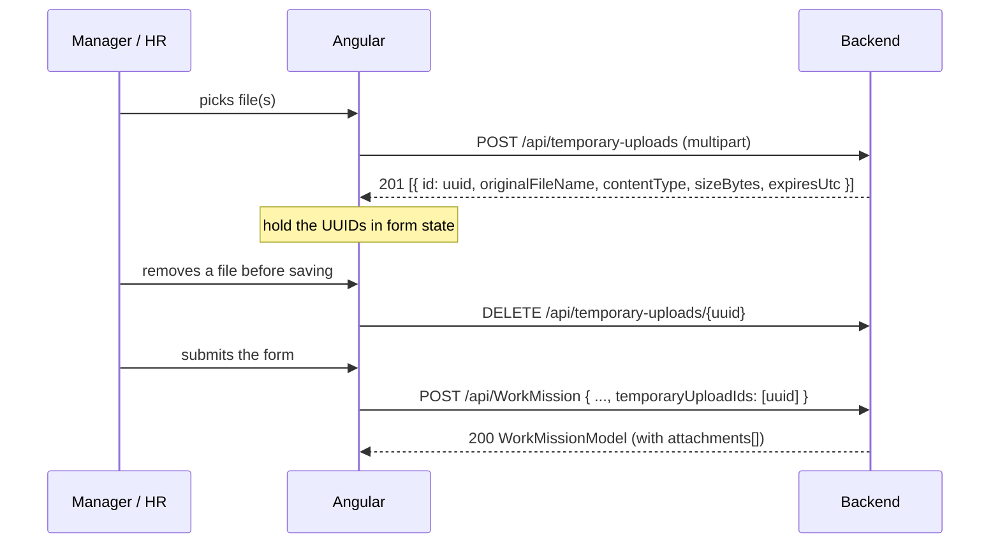

# Work Mission Attachments — Angular Frontend Guide

## Purpose

A work mission can carry up to three supporting files (PDF or image) — a mission brief, an approval letter, a map. They are attached when the mission is created, and every employee assigned to the mission can download them.

This is the same attachment mechanism already documented for permissions in `Docs/Permission-Attachments-Frontend-Guide.md`. The staging endpoints, limits, validation rules and error keys are **identical**; only the create contract, the routes and the visibility rules differ. If you have already built the permission attachment UI, the upload component is reusable as-is.

> **Breaking change — read this first.** `POST /api/WorkMission` no longer accepts a full `WorkMissionModel` body, and it now requires the Department Manager or HR Officer role. See [4. Create the mission](#4-create-the-mission).

## Table of Contents

1. [How the flow works](#how-the-flow-works)
2. [Limits and rules](#limits-and-rules)
3. [Authentication and shared contracts](#authentication-and-shared-contracts)
4. [1. Upload files to staging](#1-upload-files-to-staging)
5. [2. Remove a staged file](#2-remove-a-staged-file)
6. [3. Data contracts](#3-data-contracts)
7. [4. Create the mission](#4-create-the-mission)
8. [5. Read attachments on the list screens](#5-read-attachments-on-the-list-screens)
9. [6. Download an attachment](#6-download-an-attachment)
10. [Angular implementation](#angular-implementation)
11. [Error keys for i18n](#error-keys-for-i18n)
12. [Behaviour you must design around](#behaviour-you-must-design-around)

---

## How the flow works

Files are **not** sent with the mission form. They are uploaded first to a shared temporary staging area, which returns a UUID per file. Those UUIDs are then submitted with the mission, and the backend converts them into permanent attachments inside the same database transaction as the mission insert.



The staging endpoints are shared across every module — the same `POST /api/temporary-uploads` serves leaves, permissions and work missions. The owner type is decided by which create endpoint you send the UUIDs to, so there is nothing module-specific about the upload call itself.

---

## Limits and rules

Enforce these client-side too, so the user gets instant feedback instead of a round-trip.

| Rule | Value | Notes |
|---|---|---|
| Max files per mission | **3** | Applies both to one upload call and to the total `temporaryUploadIds` sent on create |
| Max size per file | **5 MiB** (5,242,880 bytes) | |
| Max total size per upload call | **15 MiB** (15,728,640 bytes) | |
| Hard request limit | **20 MiB** | Transport ceiling; you should never reach it if you enforce the above |
| Allowed types | `.pdf`, `.jpg`, `.jpeg`, `.png` | |
| Max image dimensions | 10,000 × 10,000 and 40 MP total | PDFs are exempt |
| Staged file lifetime | **24 hours** | After that the UUID is dead and create will fail |
| Empty files | Rejected | |

The server does not trust the file extension or the browser's `Content-Type`. It reads the file's magic bytes and parses the PDF/image structure, so a renamed executable is rejected with `ATTACHMENT_SIGNATURE_INVALID` and a corrupt image with `ATTACHMENT_CONTENT_MALFORMED`. Client-side extension checks are a convenience, not a guarantee.

---

## Authentication and shared contracts

Auth is a **`HttpOnly` cookie** (`access_token`), not a header you control. Every request below must be sent with credentials:

```ts
this.http.post(url, body, { withCredentials: true });
```

**Do not** set `Content-Type` manually on the upload call — the browser must generate the `multipart/form-data` boundary itself.

Every JSON endpoint returns the standard envelope:

```ts
interface ApiResponse<T> {
  data?: T;
  error: {
    messageKey: string;                    // stable i18n key — switch on this
    message: string;                       // English fallback, for debugging only
    details?: Record<string, string[]>;    // present on validation failures
  } | null;
}
```

Always branch on `error.messageKey`, never on `error.message`.

---

## 1. Upload files to staging

```http
POST /api/temporary-uploads
Content-Type: multipart/form-data
```

The form field name must be exactly **`files`**, repeated once per file.

**Response `201 Created`**

```json
{
  "data": [
    {
      "id": "3f2504e0-4f89-11d3-9a0c-0305e82c3301",
      "originalFileName": "mission-brief.pdf",
      "contentType": "application/pdf",
      "sizeBytes": 148213,
      "expiresUtc": "2026-08-17T09:14:22.113Z"
    }
  ],
  "error": null
}
```

**The batch is atomic.** If any file in the call fails validation, the whole call fails and *no* UUIDs are returned. Upload files **one per call** so a single bad file can be flagged without forcing the user to re-pick the others.

---

## 2. Remove a staged file

Call this when the user removes a file from the form *before* submitting, so the file does not sit on disk for 24 hours.

```http
DELETE /api/temporary-uploads/{temporaryUploadId}
```

Returns `200`. Cancelling an already-cancelled or expired upload succeeds silently, so this is safe to fire-and-forget.

| Status | `messageKey` | When |
|---|---|---|
| 404 | `TEMPORARY_UPLOAD_NOT_FOUND` | Unknown UUID, or it belongs to another user |
| 409 | `TEMPORARY_UPLOAD_ALREADY_CONSUMED` | The mission was already created with it |

---

## 3. Data contracts

```ts
/** Returned by POST /api/temporary-uploads. Lives for 24h until consumed. */
interface TemporaryUpload {
  id: string;              // UUID — this is what you send on create
  originalFileName: string;
  contentType: string;
  sizeBytes: number;
  expiresUtc: string;      // ISO-8601 UTC
}

/** A saved attachment, as returned on WorkMissionModel. */
interface WorkMissionAttachment {
  id: number;              // attachment id — use this in the download URL
  originalFileName: string;
  contentType: string;
  sizeBytes: number;
}

enum WorkMissionType {
  ShiftBeginning = 1,
  ShiftEnding = 2,
  FullDay = 3,
}

/** Request body for POST /api/WorkMission. These seven fields and nothing else. */
interface CreateWorkMissionRequest {
  nameAr: string;                  // required, max 250 chars
  nameEn?: string | null;          // optional, max 250 chars
  startDate: string;               // "YYYY-MM-DD"
  endDate: string;                 // "YYYY-MM-DD"
  description: string;             // required
  workMissionType: WorkMissionType;
  temporaryUploadIds: string[];    // 0–3 UUIDs; send [] when there are no files
}
```

> The three ID types are easy to confuse. `TemporaryUpload.id` is a **UUID** and is only valid before create. `WorkMissionAttachment.id` is an **integer** and is what the download URL takes. Neither is the underlying stored-file id, which is never exposed.

---

## 4. Create the mission

```http
POST /api/WorkMission
Content-Type: application/json
```

Requires the **Department Manager** or **HR Officer** role.

```json
{
  "nameAr": "مهمة تدقيق ميداني",
  "nameEn": "Field audit mission",
  "startDate": "2026-09-01",
  "endDate": "2026-09-03",
  "description": "Quarterly branch audit",
  "workMissionType": 3,
  "temporaryUploadIds": ["3f2504e0-4f89-11d3-9a0c-0305e82c3301"]
}
```

### ⚠️ The body must contain these seven fields and no others

The API is configured to **reject unknown JSON properties**. If you post a whole `WorkMissionModel` — with `id`, `missionCreator`, `assignedEmployees`, `isMyMission`, `concurrencyUpdateVersion`, and so on — the request fails with `400 VALIDATION_FAILED` before any business logic runs. Build a dedicated `CreateWorkMissionRequest` object; do not reuse the grid's row model.

`nameAr` and `description` are required. `temporaryUploadIds` must be present; send `[]` when the user attached nothing.

### ⚠️ The endpoint now requires a role

Creating a mission previously carried no role requirement at the API level. It is now restricted to Department Manager and HR Officer, matching the mission-management screens (`GetEmployeesToBeAssigned`, `AddUsersToMission`). Hide the "New mission" action from users without those roles, otherwise they will hit a `403`.

**Response `200 OK`** returns the created `WorkMissionModel`, whose `attachments` array reflects what was saved. Use it to update the grid without a refetch. Assigning employees is still a separate call (`POST /api/WorkMission/AddUsersToMission`) and is unchanged.

### Failure responses

| Status | `messageKey` | Meaning and what to show |
|---|---|---|
| 400 | `VALIDATION_FAILED` | Malformed body or an unknown property. Inspect `error.details`. This is a bug in your payload, not user error |
| 400 | `ATTACHMENT_TOO_MANY_FILES` | More than 3 UUIDs sent |
| 400 | `TEMPORARY_UPLOAD_IDS_INVALID` | Empty-GUID or duplicate entries in the array |
| 403 | — | The user lacks the Department Manager / HR Officer role |
| 404 | `TEMPORARY_UPLOAD_NOT_FOUND` | A UUID is unknown, or was uploaded by a different user |
| 409 | `TEMPORARY_UPLOAD_NOT_AVAILABLE` | A UUID expired (>24h) or was already used |

**Nothing is partially saved.** The mission row and the attachment links commit or roll back together. If create fails, the staged UUIDs are still valid (unless they expired), so the user can fix the form and resubmit with the same IDs. Do not clear the attachment list from your form state on a failed submit.

---

## 5. Read attachments on the list screens

Both paginated endpoints now return an `attachments` array on every row. No request change is needed.

```http
POST /api/WorkMission/GetWithPaging              # department missions (manager / HR view)
POST /api/WorkMission/GetMyWorkMissionsAsync     # missions I am assigned to (Employee role)
```

```json
{
  "data": {
    "list": [
      {
        "id": 512,
        "nameAr": "مهمة تدقيق ميداني",
        "nameEn": "Field audit mission",
        "startDate": "2026-09-01",
        "endDate": "2026-09-03",
        "description": "Quarterly branch audit",
        "workMissionType": 3,
        "isMyMission": true,
        "isMissionCreator": false,
        "attachments": [
          {
            "id": 87,
            "originalFileName": "mission-brief.pdf",
            "contentType": "application/pdf",
            "sizeBytes": 148213
          }
        ]
      }
    ],
    "paginationInfo": { "currentPage": 1, "pageSize": 10, "totalPages": 4, "totalItems": 34 }
  },
  "error": null
}
```

The array is always present and is `[]` when there are no attachments — no null check needed. It is ordered oldest-first and excludes files pending deletion, so anything listed is downloadable.

The employee-facing grid is where this matters most: an assigned employee opens their mission row and downloads the brief. Surface the attachment count or a paperclip icon on both grids.

---

## 6. Download an attachment

```http
GET /api/WorkMission/{workMissionId}/attachments/{attachmentId}/content
```

`attachmentId` is `attachments[].id` from the row. Both IDs are checked together — an attachment id belonging to a different mission returns 404.

Three things to get right:

**Use `responseType: 'blob'` with credentials.** Do not build a plain `<a href>` or `window.open` — a denied or missing file returns a JSON error body, which would open a blank tab or save a file full of JSON instead of showing an error.

**Take the filename from the row, not the response.** The server sends `Content-Disposition`, but CORS does not expose that header to JavaScript, so it reads as `null` in the browser. Use the `originalFileName` you already have on `attachments[]`.

**Treat 404 as "not available".** Authorization failures deliberately return `404 RESOURCE_NOT_FOUND` rather than 403, so the API never reveals whether a mission exists to someone who may not see it. Show a neutral "attachment is not available" message; do not word it as a permissions error.

Who can download: any employee **assigned to the mission**, the **mission creator**, and an **HR officer or department manager** whose department scope the mission touches. In practice anyone who can see the row on either grid can open its attachments, so you do not need to compute visibility client-side — render the download button whenever `attachments` is non-empty.

---

## Angular implementation

The upload and cancel calls are module-agnostic. If you already have a `TemporaryUploadService` from the permission work, reuse it and add only the mission-specific calls.

```ts
import { HttpClient } from '@angular/common/http';
import { Injectable, inject } from '@angular/core';
import { Observable, map } from 'rxjs';

export const ATTACHMENT_LIMITS = {
  maxFiles: 3,
  maxFileSizeBytes: 5 * 1024 * 1024,
  maxBatchSizeBytes: 15 * 1024 * 1024,
  allowedExtensions: ['.pdf', '.jpg', '.jpeg', '.png'],
} as const;

@Injectable({ providedIn: 'root' })
export class TemporaryUploadService {
  private readonly http = inject(HttpClient);

  /** Shared by leaves, permissions and work missions. Call once per file. */
  upload(file: File): Observable<TemporaryUpload> {
    const form = new FormData();
    form.append('files', file, file.name);   // field name must be "files"

    // No Content-Type header — the browser sets the multipart boundary.
    return this.http
      .post<ApiResponse<TemporaryUpload[]>>('/api/temporary-uploads', form, {
        withCredentials: true,
      })
      .pipe(map(res => res.data![0]));
  }

  cancel(temporaryUploadId: string): Observable<void> {
    return this.http
      .delete<ApiResponse<string>>(`/api/temporary-uploads/${temporaryUploadId}`, {
        withCredentials: true,
      })
      .pipe(map(() => void 0));
  }
}

@Injectable({ providedIn: 'root' })
export class WorkMissionService {
  private readonly http = inject(HttpClient);

  create(request: CreateWorkMissionRequest): Observable<WorkMissionModel> {
    // Send exactly this shape. Extra properties are rejected by the API.
    return this.http
      .post<ApiResponse<WorkMissionModel>>('/api/WorkMission', request, {
        withCredentials: true,
      })
      .pipe(map(res => res.data!));
  }

  downloadAttachment(
    workMissionId: number,
    attachment: WorkMissionAttachment,
  ): Observable<void> {
    return this.http
      .get(`/api/WorkMission/${workMissionId}/attachments/${attachment.id}/content`, {
        responseType: 'blob',
        withCredentials: true,
      })
      .pipe(map(blob => this.saveAs(blob, attachment.originalFileName)));
  }

  /** Filename comes from the row: CORS does not expose Content-Disposition. */
  private saveAs(blob: Blob, fileName: string): void {
    const url = URL.createObjectURL(blob);
    const link = document.createElement('a');
    link.href = url;
    link.download = fileName;
    link.click();
    URL.revokeObjectURL(url);
  }
}
```

### Client-side pre-validation

Catching these before the request saves a round-trip, but keep the server error handling — only the server checks the file's actual content.

```ts
function validate(file: File, alreadyStaged: TemporaryUpload[]): string | null {
  if (alreadyStaged.length >= ATTACHMENT_LIMITS.maxFiles) return 'ATTACHMENT_TOO_MANY_FILES';
  if (file.size === 0) return 'ATTACHMENT_EMPTY_FILE';
  if (file.size > ATTACHMENT_LIMITS.maxFileSizeBytes) return 'ATTACHMENT_FILE_TOO_LARGE';

  const extension = file.name.slice(file.name.lastIndexOf('.')).toLowerCase();
  if (!ATTACHMENT_LIMITS.allowedExtensions.includes(extension as never)) {
    return 'ATTACHMENT_TYPE_NOT_ALLOWED';
  }

  const total = alreadyStaged.reduce((sum, f) => sum + f.sizeBytes, file.size);
  if (total > ATTACHMENT_LIMITS.maxBatchSizeBytes) return 'ATTACHMENT_BATCH_TOO_LARGE';

  return null;
}
```

Reuse the same `messageKey` strings your error interceptor already translates, so pre-validation and server rejections render identically.

### Form component sketch

```ts
readonly staged = signal<TemporaryUpload[]>([]);

onFilesPicked(files: FileList): void {
  for (const file of Array.from(files)) {
    const clientError = validate(file, this.staged());
    if (clientError) { this.toast.error(this.i18n.translate(clientError)); continue; }

    this.uploads.upload(file).subscribe({
      next: staged => this.staged.update(list => [...list, staged]),
      error: (err: HttpErrorResponse) =>
        this.toast.error(this.i18n.translate(err.error?.error?.messageKey ?? 'SERVER_ERROR')),
    });
  }
}

removeStaged(upload: TemporaryUpload): void {
  this.staged.update(list => list.filter(x => x.id !== upload.id));
  this.uploads.cancel(upload.id).subscribe({ error: () => {} }); // best-effort
}

submit(): void {
  const request: CreateWorkMissionRequest = {
    nameAr: this.form.value.nameAr,
    nameEn: this.form.value.nameEn,
    startDate: this.form.value.startDate,
    endDate: this.form.value.endDate,
    description: this.form.value.description,
    workMissionType: this.form.value.workMissionType,
    temporaryUploadIds: this.staged().map(x => x.id),
  };

  this.missions.create(request).subscribe({
    next: created => { this.staged.set([]); this.dialogRef.close(created); },
    // Keep this.staged() intact — the UUIDs are still usable on retry.
    error: (err: HttpErrorResponse) =>
      this.toast.error(this.i18n.translate(err.error?.error?.messageKey ?? 'SERVER_ERROR')),
  });
}
```

---

## Error keys for i18n

These are the same keys used by permission and leave attachments — if you already added them, there is nothing new to translate here.

| Key | Suggested English | Suggested Arabic |
|---|---|---|
| `ATTACHMENT_FILES_REQUIRED` | At least one file is required. | يجب إرفاق ملف واحد على الأقل. |
| `ATTACHMENT_TOO_MANY_FILES` | You can attach up to 3 files. | يمكنك إرفاق ٣ ملفات كحد أقصى. |
| `ATTACHMENT_FILE_TOO_LARGE` | Each file must be 5 MB or smaller. | يجب ألا يتجاوز حجم الملف ٥ ميجابايت. |
| `ATTACHMENT_BATCH_TOO_LARGE` | Total attachment size must be 15 MB or smaller. | يجب ألا يتجاوز إجمالي حجم المرفقات ١٥ ميجابايت. |
| `ATTACHMENT_EMPTY_FILE` | The file is empty. | الملف فارغ. |
| `ATTACHMENT_TYPE_NOT_ALLOWED` | Only PDF, JPEG, and PNG files are allowed. | يُسمح فقط بملفات PDF و JPEG و PNG. |
| `ATTACHMENT_SIGNATURE_INVALID` | The file content could not be verified. | تعذر التحقق من محتوى الملف. |
| `ATTACHMENT_EXTENSION_MISMATCH` | The file extension does not match its content. | امتداد الملف لا يطابق محتواه. |
| `ATTACHMENT_CONTENT_MALFORMED` | The file is corrupt or unreadable. | الملف تالف أو غير قابل للقراءة. |
| `ATTACHMENT_IMAGE_DIMENSIONS_EXCEEDED` | The image dimensions are too large. | أبعاد الصورة كبيرة جدًا. |
| `ATTACHMENT_FILE_NAME_INVALID` | The file name is invalid. | اسم الملف غير صالح. |
| `ATTACHMENT_STORAGE_UNAVAILABLE` | File storage is temporarily unavailable. | خدمة تخزين الملفات غير متاحة مؤقتًا. |
| `TEMPORARY_UPLOAD_NOT_FOUND` | The uploaded file is no longer available. | الملف المرفوع لم يعد متاحًا. |
| `TEMPORARY_UPLOAD_NOT_AVAILABLE` | An attachment expired. Please upload it again. | انتهت صلاحية أحد المرفقات. يرجى رفعه مرة أخرى. |
| `TEMPORARY_UPLOAD_ALREADY_CONSUMED` | The attachment is already linked to a request. | المرفق مرتبط بالفعل بطلب. |
| `TEMPORARY_UPLOAD_FILE_NOT_AVAILABLE` | An attachment is no longer available. Please upload it again. | أحد المرفقات لم يعد متاحًا. يرجى رفعه مرة أخرى. |
| `TEMPORARY_UPLOAD_IDS_INVALID` | Invalid attachment references. | مراجع المرفقات غير صالحة. |
| `RESOURCE_NOT_FOUND` | The attachment is not available. | المرفق غير متاح. |
| `CAN_NOT_TAKE_ACTION` | You cannot modify this mission. | لا يمكنك تعديل هذه المهمة. |
| `VALIDATION_FAILED` | Please check the entered data. | يرجى التحقق من البيانات المدخلة. |

`ATTACHMENT_STORAGE_UNAVAILABLE` returns HTTP 503 and means the file server is down, not that the user did anything wrong — word it as a retry-later message.

---

## Behaviour you must design around

**Attachments are set at creation only.** There is no endpoint to add or remove an attachment on an existing mission. `PUT /api/WorkMission` ignores attachments entirely; editing a mission leaves its files untouched. The edit dialog should render existing attachments read-only (name, size, download) with no add or delete control. If the files need to change, the mission has to be deleted and recreated.

**Only the mission creator can edit or delete.** `PUT` and `DELETE /api/WorkMission/{id}` both reject a non-creator with `400 CAN_NOT_TAKE_ACTION`, even for HR. Use the `isMissionCreator` flag already on each grid row to decide whether to show those actions — do not infer it from the user's role.

**Deleting a mission removes its attachments.** Unlike permissions, there is no status gate: a creator can delete a mission at any time. The files then enter a 30-day retention window before permanent removal, but they disappear from the API immediately.

**Staged UUIDs are single-use and user-scoped.** Once consumed they cannot be reused; a second create with the same UUID fails with `TEMPORARY_UPLOAD_NOT_FOUND`. They are also tied to the uploading user, so they cannot be shared across sessions or users.

**Watch the 24-hour clock on long-lived forms.** A draft left open overnight will hold expired UUIDs and fail on submit with `TEMPORARY_UPLOAD_NOT_AVAILABLE`. If a form can stay open that long, compare `expiresUtc` before submitting and prompt the user to re-upload.

**The upload call is the slow one.** Show a per-file progress indicator (`reportProgress: true` with `observe: 'events'`) and disable the submit button while any upload is in flight, so the user cannot submit with a UUID that has not arrived yet.

---

## Related documents

- `Docs/Permission-Attachments-Frontend-Guide.md` — the same feature for permissions; the upload component is shared.
- `Docs/Attachment-Integration-Guide.md` — backend guide for adding attachments to another entity.
- `Docs/Staged-Leave-Attachment-Implementation.md` — the original design, including the full validation and security model.
